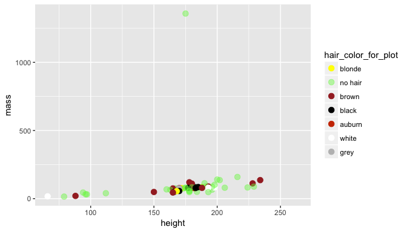

# Custom colors on plot
Mine Cetinkaya-Rundel  
9/6/2017  


**Question: Is it possible to use Star Wars characters' hair color for coloring points on a scatterplot of their heights vs. weights?**

Absolutely! Though it takes a bit of tweeaking, and some code you have not yet encountered in class.

Let's start by loading required packages:


```r
library(ggplot2)
library(dplyr)
library(stringr) # for text string parsing
```

Before we can plot, there is a data issue we need to address: Some characters have multiple hair colors listed, or hair colors that are not text strings that R recognizes as colors. To see a full list of colors you can refer to by name in R, see http://www.stat.columbia.edu/~tzheng/files/Rcolor.pdf. (Note that you can also use HEX or rgb codes for colors.)

1. Assess the current state of the `hair_color` variable. We can do this by making a frequency table for the levels of this variable.


```r
starwars %>%
  count(hair_color)
```

```
## # A tibble: 13 x 2
##       hair_color     n
##            <chr> <int>
##  1        auburn     1
##  2  auburn, grey     1
##  3 auburn, white     1
##  4         black    13
##  5         blond     3
##  6        blonde     1
##  7         brown    18
##  8   brown, grey     1
##  9          grey     1
## 10          none    37
## 11       unknown     1
## 12         white     4
## 13          <NA>     5
```

2. We need to first clean up the data a a bit. We'll do this in two stages:

- Recode `hair_color` so that each character only has one hair color or `"no hair"`
- Create a new variable that has actual colors that R will interpret as such (for example yellow instead of blonde)


```r
starwars <- starwars %>%
  mutate(
    hair_color = case_when(
      hair_color %in% c("blond", "blonde")     ~ "blonde",
      hair_color %in% c(NA, "none", "unknown") ~ "no hair",
      str_detect(hair_color, "auburn")         ~ "auburn",
      str_detect(hair_color, "brown")          ~ "brown",
      TRUE                                     ~ hair_color
    ),
    hair_color_for_plot = case_when(
      hair_color == "blonde"                   ~ "yellow",
      hair_color == "auburn"                   ~ "orangered3",
      hair_color %in% c("brown", "black", "white", "grey") ~ hair_color,
      hair_color == "no hair"                  ~ "#73F44A70"
    )
  )
```

3. Plot using `hair_color_for_plot` for defining the actual colors to be plotted and `hair_color` for labels to be used in the legend.


```r
ggplot(data = starwars, aes(x = height, y = mass, color = hair_color_for_plot)) +
  geom_point(size = 3) +
  scale_color_identity(breaks = starwars$hair_color_for_plot, 
                       labels = starwars$hair_color, 
                       guide = "legend")
```

```
## Warning: Removed 28 rows containing missing values (geom_point).
```

<!-- -->
